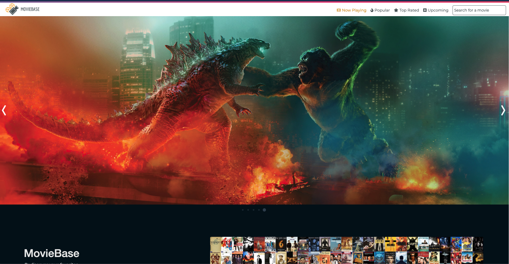
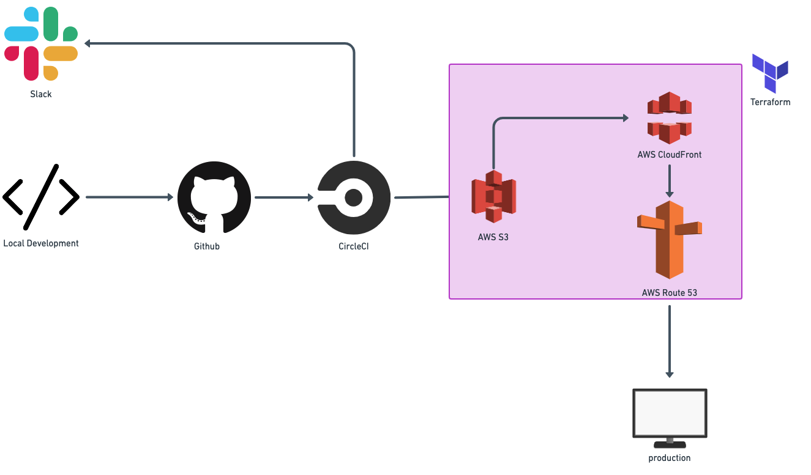
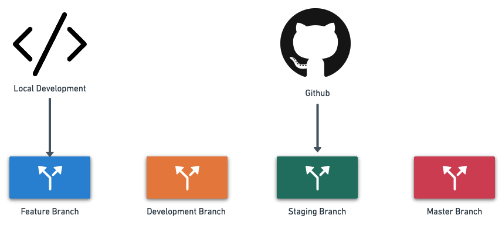

## MovieBase

_Rediscover your favorites_



Browse our collection of movies from the most popular to the highest rated. Preview upcoming movies or search for your favorites.

### Features

- CI/CD using CircleCI
- Integrate Slack with CircleCI for notifications
- Build AWS resources using Terraform
- Deploy app to S3 bucket and distribute content using CloudFront
- Setup linting and prettier checks
- Redux for state management
- CSS Grid to make app mobile responsive
- Infinite scrolling
- Image lazy loading
<!-- - Docker for container services
- Sentry for error tracking -->
- testing using react testing library
- custom domain using route 53

### Architecture



### Github workflow

- developer works locally in feature branch
- working with three environments: development, staging, production. Each environment will have it's own S3 bucket
- once feature is complete, dev merges into dev branch (dev environment)
- once feature is working as required, merge dev branch -> staging branch (staging environment)
- can merge from staging -> master branch (prod environment)
  

### Run locally

- Clone the repo

- Run `npm install`

- Create an account on [https://www.themoviedb.org/](https://www.themoviedb.org/) and obtain an API key.

- Create a .env file in the root of the project and add

```js
REACT_APP_API_SECRET=your api key
```
