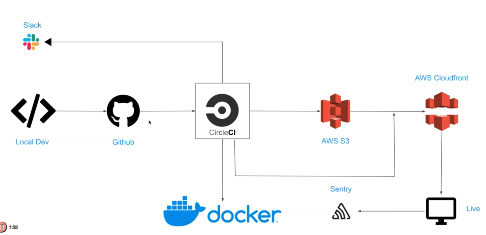
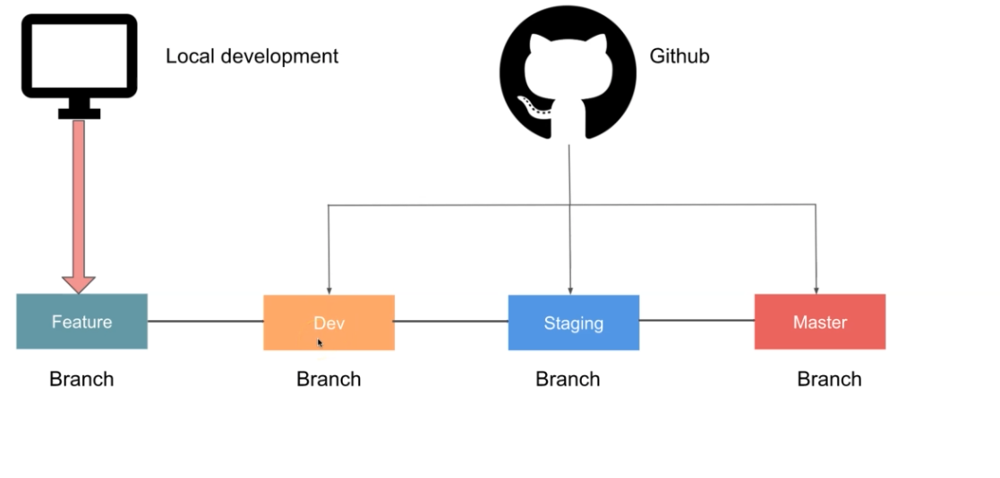

## Movie App

### App Architecture

### App Features

- Github for code repository using feature branches and three main stages: development, staging, and master
- CI/CD using CircleCI
- Build AWS resources using Terraform
- Deploy app to S3 bucket and distribute content using CloudFront
- Setup linting and prettier checks
- Redux for state management
- CSS Grid to make app mobile responsive
- Infinite scrolling
- Image lazy loading
- Dockerize app
- setup monitoring using Sentry

### Github workflow

- developer works locally in feature branch
- working with three environments: development, staging, production. Each environment will have it's own S3 bucket
- once feature is complete, dev merges into dev branch (dev environment)
- once feature is working as required, merge dev branch -> staging branch (staging environment)
- can merge from staging -> master branch (prod environment)
  
