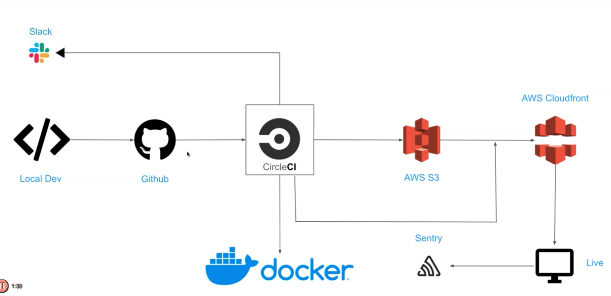

## Movie App

### App Architecture

### App Features

- Github for code repository using feature branches and three main stages: development, staging, and master
- CI/CD using CircleCI
- Build AWS resources using Terraform
- Deploy app to S3 bucket and distribute content using CloudFront
- Setup linting and prettier checks
- Redux for state management
- CSS Grid to make app mobile responsive
- Infinite scrolling
- Image lazy loading
- Dockerize app
- setup monitoring using Sentry
